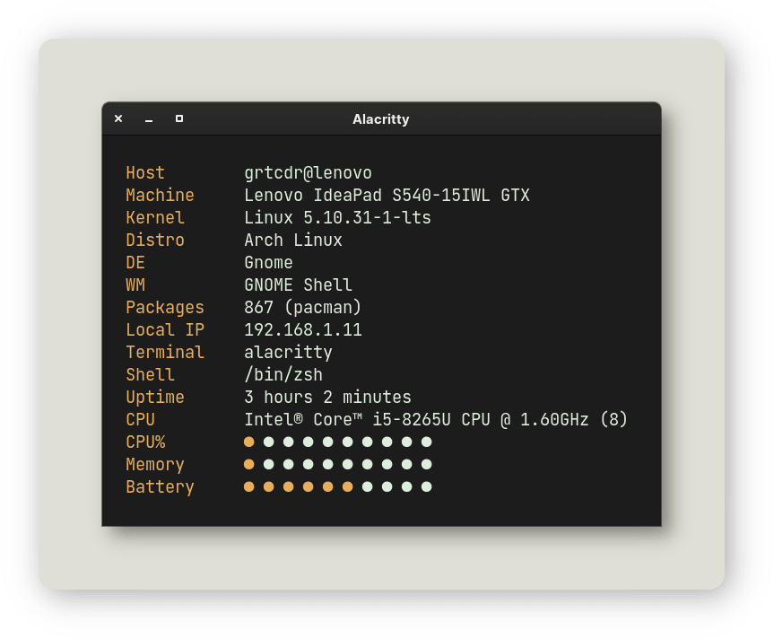
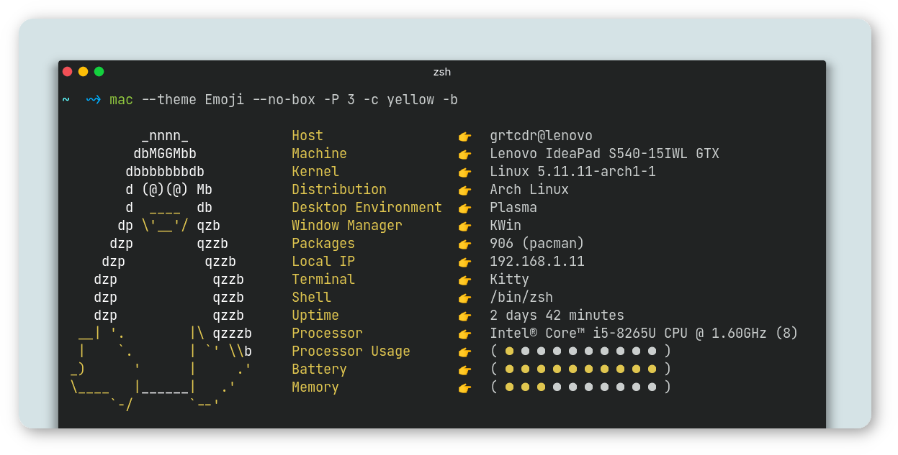

<div align="center">
<h1>Macchina</h1>

Fast, minimal and customizable system information fetcher.

Linux • macOS • Windows • NetBSD • OpenWrt


<a href="https://crates.io/crates/macchina">
    
</a>

<a href="https://crates.io/crates/macchina">
    
</a>

<a href="https://saythanks.io/to/ba.tahaaziz@gmail.com">
    
</a>
</div>

---

# Table of Contents
- [About](#about)
- [Minimalism](#minimal)
- [Performance](#perf)
- [Features](#features)
- [Dependencies](#deps)
- [Usage](#usage)
- [Installation](#install)
- [Platform Support](#platform-support)
- [Contributors](#contributors)
---

# About Macchina <a name="about"></a>
_Macchina_ lets you view basic system information, like your hostname, kernel, uptime, memory usage, and much more.
It provides you with convenient features and extensive customization options but doesn't lose sight of its two main priorities, [minimalism](#minimal) and [performance](#perf).

Are you ricing your desktop and would like a program to display your system information, or you want it to load as soon as you open your terminal?

_Macchina_ has you covered.

If you're interested in the library _Macchina_ uses to fetch your system information, check out [libmacchina](https://github.com/Macchina-CLI/libmacchina), any issues relating to _fetching_ should be filed on that repository.

---

# Minimalism <a name="minimal"></a>

_Macchina_ first started as a barebones fetcher, but has evolved to incorporate the many aspects people love to see in their fetcher. This evolution however did not discard the minimalistic look that I envisioned for it.

Here's what you can make it look like using the various supported flags.

```
macchina -c white --no-box --no-ascii --no-separator --no-bar-delimiter --bar
```



---

# Performance <a name="perf"></a>
_Macchina_ is pretty fast, see for yourself!

- Execution time is measured using [hyperfine](https://github.com/sharkdp/hyperfine)

## 🐧 Linux

| Command | Mean [ms] | Min [ms] | Max [ms] | Relative |
|:---|---:|---:|---:|---:|
| `macchina` | 18.8 ± 1.5 | 17.0 | 21.8 | 1.00 |
| `neofetch` | 218.3 ± 1.8 | 216.0 | 222.8 | 11.64 ± 0.92 |

`macchina` runs __11.64 ± 0.92__ times __faster__ than `neofetch`

## 👩🏽‍💻 macOS

| Command | Mean [ms] | Min [ms] | Max [ms] | Relative |
|:---|---:|---:|---:|---:|
| `macchina` | 5.0 ± 0.2 | 4.7 | 5.9 | 1.00 |
| `neofetch` | 484.5 ± 4.3 | 477.2 | 492.3 | 97.10 ± 3.84 |

`macchina` runs __97.10 ± 3.84__ times __faster__ than `neofetch`

## 🚩 NetBSD

| Command | Mean [ms] | Min [ms] | Max [ms] | Relative |
|:---|---:|---:|---:|---:|
| `macchina` | 23.0 ± 2.5 | 21.2 | 32.0 | 1.00 |
| `neofetch` | 275.9 ± 11.3 | 267.4 | 296.0 | 12.00 ± 1.38 |

`macchina` runs __12.00 ± 1.38__ times __faster__ than `neofetch`

## 💻 Windows
| Command | Mean [ms] | Min [ms] | Max [ms] | Relative |
|:---|---:|---:|---:|---:|
| `macchina` | 9.0 ± 0.4 | 8.2 | 11.7 | 1.00 |
| `neofetch` | 2207.7 ± 53.8 | 2127.1 | 2325.9 | 244.38 ± 13.43 |

`macchina` runs __244.38 ± 13.43__ times __faster__ than `neofetch`

---

# Features <a name="features"></a>
## Themes
The [themes wiki page](https://github.com/grtcdr/macchina/wiki/Themes) contains a list of all the built-in themes that you can switch between using the `--theme` flag.



## Bars
Bars provide a way to visualize data, and each theme styles them differently. They can be enabled using the `--bar` flag.


## What it fetches
- Host
  - Username
  - Hostname
- Product
- Kernel
- Distribution
- Operating System
- Desktop Environment
- Window Manager
- Package Count [[1]](https://github.com/grtcdr/macchina/wiki/Platform-Support)
- Terminal
- Shell
- Uptime
- Processor
  - Model
  - Logical Cores
- Local IP Address
- Processor Usage
- Memory Usage
- Battery
  - Percentage
  - Status
- Palette

## Meet Doctor
_Macchina_ comes with a very special flag, allowing you analyze which elements failed to fetch, and why. It can differentiate between errors, and warnings, and its comprehensive output should help you understand where the issue is coming from.

```
macchina --doctor
```


---

# Usage <a name="usage"></a>
_Macchina_ comes packed with __arguments__ that let you customize its behavior and styling.

The [usage wiki page](https://github.com/grtcdr/macchina/wiki/Usage) can tell you all about them and how they work.

---

# Dependencies <a name="deps"></a>
## 🐧 Linux:
- `wmctrl`
- __Gentoo Only:__ `portage-utils`
## 🚩 NetBSD:
- `wmctrl`

The [dependencies wiki page](https://github.com/grtcdr/macchina/wiki/Dependencies) explains why these dependencies exist.

---

# Installation <a name="install"></a>
### 🦀 crates.io
```
cargo install macchina
```

### 📦 pkgsrc
```
pkgin install macchina
```

### 🍻 Homebrew
```
brew install Macchina-CLI/homebrew-tap/macchina
```

### AUR
- _Macchina_ — latest release:

```
git clone https://aur.archlinux.org/macchina.git
cd macchina
makepkg -si
```

- _Macchina_ — `main` branch:

```
git clone https://aur.archlinux.org/packages/macchina-git macchina
cd macchina
makepkg -si
```

_Macchina's_ [installation wiki page](https://github.com/grtcdr/macchina/wiki/Installation) lists other ways you can install the program. You might also prefer running the [prebuilt binary](https://github.com/grtcdr/macchina/releases) that corresponds with your operating system.

---

# Platform Support <a name="platform-support"></a>

|  Platform |      Support       |
| :-:       |        :-:         |
| GNU/Linux |        Yes         |
| NetBSD    |        Yes         |
| macOS     |        Yes         |
| Windows   |        80%         |
| OpenWrt   |        Yes         |
| Android   |        Soon        |

# 🌍 Contributors <a name="contributors"></a>

[](https://github.com/grtcdr/macchina/graphs/contributors)

_Macchina_, like many other open-source projects, would not be where it is right now without the help of its contributors, thank you all so much!

- Support for __NetBSD__ would not be possible without the help and testing of NetBSD/pkgsrc package maintainer [pin](https://pkgsrc.se/bbmaint.php?maint=pin@NetBSD.org)
- Support for __macOS__ and __Windows__ would not be possible without the help, testing and major contributions of [123marvin123](https://github.com/123marvin123)
- Support for __OpenWrt__ was made possible through the contributions of [uttarayan21](https://github.com/uttarayan21)
