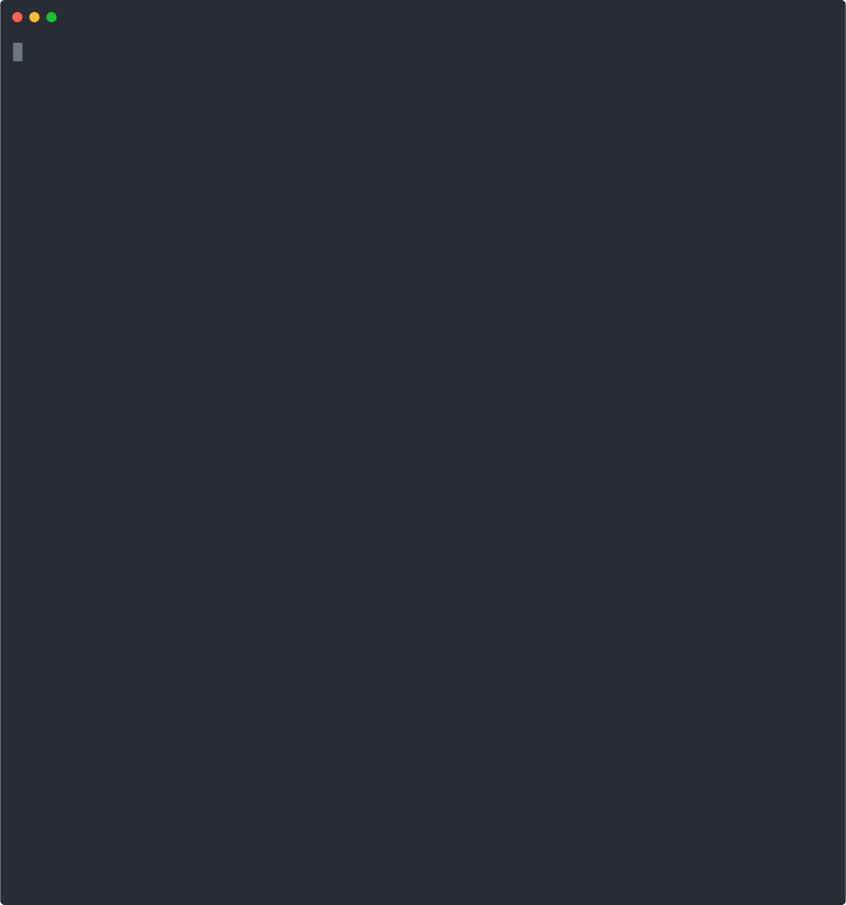

<h1 align="center"> Macchina </h1>

  

## Table of Contents:
- [About](#about)
- [Features](#features)
- [Installation](#install)
- [Platform support](#platform-support)

---

## About Macchina 
Macchina lets you flex... I mean view system information.

#### Macchina's Dependencies (included in Cargo.toml):
- [colored](https://crates.io/crates/colored)

Macchina is pretty fast, see for yourself:

- Execution time is measured using [time](https://www.gnu.org/software/time/)
- Execution time might differ on your machine

|                   | Macchina      | Neofetch   |
| ----------------- | -----------   | ---------- |
| Execution Time    | ~0.024s       | ~0.286s    |

---

## Features 
Macchina, in its current state, displays basic system information such as:
- Hostname
- Operating system
- Kernel version
- Default terminal
- Default shell
- Uptime
- CPU _model name_, _frequency_ and _thread count_
- Battery _percentage_ and _status_
- Package count __(coming)__

Macchina supports the following arguments:
- --no-color for disabling color
- --palette for displaying the palette
- --hide for hiding elements
- --help

---

## Installation 

Macchina is not yet ready to be deployed on [crates.io](https://crates.io/), but you can compile it from source and play around with it.

Here's how _you_ can do that:

1. Clone the repo: `git clone https://github.com/grtcdr/macchina`
2. Navigate to the folder and compile from source: `cd macchina && cargo build`
3. __target/__ has been generated by cargo and Macchina's binary file can now be run: `./target/debug/macchina`

__Bonus__: To run macchina from anywhere on your system, you have two options:

1. Place `macchina/target/debug/macchina` somewhere in your __$PATH__, like _~/.local/bin_ or _/usr/bin_.

:heavy_exclamation_mark: Any changes you make to the source code will apply to the macchina binary file but you'll need to place the newly built binary file on your __$PATH__ __again__ to run it from _anywhere on your system_ with your new changes.

2. Create a new symlink for Macchina:

:heavy_exclamation_mark: This symlink will point to the binary file, so everytime you modify the source code and rebuild, running `$ macchina` from _anywhere on your system_ will run the newly built binary file.

---

## Will Macchina Work on Your Macchina? 

|  Platform     |      Support       |
| :-:           |        :-:         |
| Linux         | :heavy_check_mark: |
| BSD           |     :question:     |
| MacOS         |                    |
| Windows       |                    |

> Cells containing :question: have not yet been tested.
