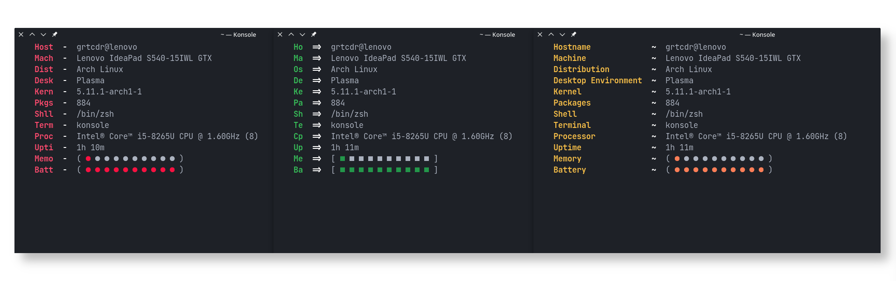

<h1 align="center"> Macchina </h1>

<p align="center">
  
  <a href="https://forthebadge.com/images/badges/made-with-rust.svg" alt="Made With Rust Badge"></a>
</p>

[](https://crates.io/crates/macchina)
[](https://crates.io/crates/macchina)


## Table of Contents:
- [About](#about)
- [Changelog](#change)
- [Benchmarks](#bench)
- [Features](#features)
- [Installation](#install)
- [Platform Support](#platform-support)

---

# About Macchina <a name="about"></a>
Macchina lets you view basic system information, like your hostname, your kernel version, memory usage, and much more.
No one wants a slow fetcher, and Macchina's main goal is to provide you with handy features while keeping performance a priority.

# Changelog <a name="change"></a>
The most recent commits have focused primarily on supporting __NetBSD__, Macchina previously panics at almost every step on a BSD system, because it obtained machine information through files that might not exist on non-Linux systems.
Although the coming pushes to the repository might not be efficient, I will always work to keep Macchina under the 50ms threshold!

Macchina will no longer read from different files to fetch your system information, it will soon start using `sysctl` as much as possible to keep the code _clean_ and _uniform_, and will allow the program to work on many different platforms other than Linux.

The thought of bringing Macchina to more than one system seems bigger than me, but thanks to help of NetBSD package maintainer __voidpin__, I'm working towards that goal!

- Added Cargo.lock as per the request of __voidpin__, and removed it `.gitignore`
- Added kernel.rs: responsible for extracting information about the kernel
- Kernel information now includes the kernel name `kernel.ostype / kern.ostype`, and both `kernel.ostype / kern.ostype` and `kernel.kernel.osrelease / kern.osrelease` are read through the `sysctl' interface
- Product information should now appear on NetBSD systems
- Simplify some error messages
- Read CPU Information by running `grep "model name" /proc/cpuinfo | head -n1` instead of reading from file
- Read Distribution name by running `cat /etc/os-release | head -n1` instead of through `lsb_release`__(~4ms difference)__
- Make memory extraction more reliable by running `cat /proc/meminfo | grep KEY`, all memory functions have switched to this implementation to avoid getting their value from a specified line number, which can sometimes be very unreliable. This has however introduced slower execution time, but reliability and correct information is better than blazing fast speeds.
- Added support for obtaining package count on debian-based systems and NetBSD
- Macchina now prints your window manager!
- Hide unused import warnings

---

# Benchmarks <a name="bench"></a>
Macchina is pretty fast, see for yourself:

- Execution time is measured using [hyperfine](https://github.com/sharkdp/hyperfine)

| Command | Mean [ms] | Min [ms] | Max [ms] | Relative |
|:---|---:|---:|---:|---:|
| `macchina` | 22.2 ± 0.7 | 21.0 | 25.1 | 1.00 |
| `neofetch` | 243.9 ± 2.3 | 240.0 | 246.9 | 11.01 ± 0.37 |

__Summary__: `macchina` runs __11.01 ± 0.37__ times __faster__ than `neofetch`

- Note that hiding elements using Macchina's __--hide <element>__ significantly improves speed

---

# Features <a name="features"></a>
## Themes:


## Macchina displays basic system information such as:
- Host
  - Username
  - Hostname
- Product
  - Manufacturer
  - Model name & version
- Kernel
  - Name
  - Version
- Distribution
- Desktop Environment
- Window Manager
- Package count
- Shell
- Terminal
- Processor
  - Model name
  - Frequency
  - Thread count
- Uptime
- Memory
  - Used / Total
- Battery
  - Percentage
  - Status
- Palette

Package Count supports the following package managers:
- Arch-based distributions
- Debian-based distributions
- NetBSD

Macchina requires [wmctrl](https://linux.die.net/man/1/wmctrl) to be installed to print your Window Manager.

## Macchina supports the following arguments:

`--no-color / -n` - Disable colors

`--color / -c <color>` - Specify the key color

`--separator-color / -C <color>` - Specify the separator color

`--random-color / -r` - Let Macchina pick a random color for you

`--palette / -p` - Display palette

`--short-sh / -s` - Shorten shell output (/bin/zsh -> zsh)

`--hide / -H <element>` - Hide elements such as host, os, kern, etc.

`--bar / -b` - Display memory usage and battery percentage as bars


`--theme / -t <theme_name>` - Specify the theme to use

`--padding / -P <amount>` - Specify the amount of (left) padding to use

`--spacing / -S <amount>` - Specify the amount of spacing to use

`--help / -h` -  Print help text

`--version / -v` - Print version

---

# Installation <a name="install"></a>
Macchina is available on:

- [AUR](https://aur.archlinux.org/packages/macchina/)

  Install using your favorite AUR helper or by running:
  ```
  git clone https://aur.archlinux.org/macchina.git
  cd macchina
  makepkg -si
  ```
- [crates.io](https://crates.io/crates/macchina)

  Install using cargo:
  ```
  cargo install macchina
  ```

---

# Platform Support <a name="platform-support"></a>

|  Platform     |      Support       |
| :-:           |        :-:         |
| Linux         | :heavy_check_mark: |
| NetBSD        |     :question:     |
| MacOS         |                    |
| Windows       |                    |

Cells containing :heavy_check_mark:: Macchina supports that platform

Cells containing :question:: Macchina has partial support for that platform

Empty cells: Macchina does not support that platform
