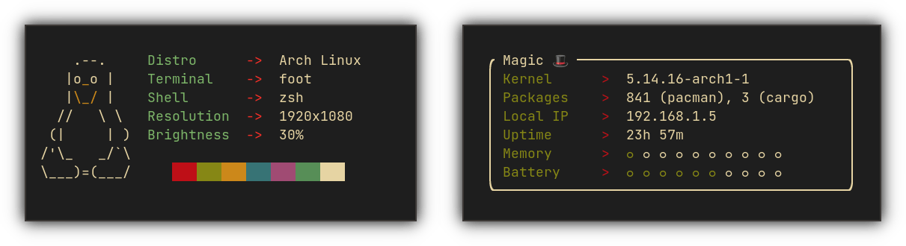

<div align="center">
<h1>macchina</h1>

Fast, minimal and customizable system information frontend.

Linux • macOS • Windows • NetBSD • FreeBSD • OpenWrt • Android


</div>

## About

[macchina](https://crates.io/crates/macchina) lets you view system
information, like your kernel version, uptime, memory usage, processor
load and much more. _macchina_ is basic by default and extensible by
design.

If you're interested in the library _macchina_ uses to fetch system
information, have a look at [libmacchina]; fetching-related issues
should be filed on that repository.

## Status

_macchina_ is currently in **maintenance mode**, meaning bug fixes and
little optimizations are much more prioritized over the addition of
new features. This is due to the fact that we (the authors) do not
have the time to focus on moving the project forward, or expanding on
what is currently offered while keeping up with the demanding nature
of our lives. _macchina_ will at some point (although I can't say
when) leave this stage and implement all the bells and whistles the
community has been requesting.

We hope you understand our situation and continue to support _macchina_.

## Benchmarks

Check out the [benchmarks wiki page](https://github.com/Macchina-CLI/macchina/wiki/Benchmarks).

## Features

### Themes

_macchina_ has a theming system which you can use to customize pretty much any
visual aspect of the program. Themes live **outside** the configuration file,
so you can create a bunch of them and switch between them at any time.

Why are they separate?

- **Modularity** — themes are an engine of their own, and their sole purpose is
  to provide an interface that allows for the modification of _macchina's_
  visual components. It makes sense to separate them from the main
  configuration file.

- **Portability** — sure, the configuration file is shareable, but what if you
  wanted to share the look of _your macchina_ and not its behavior? What if you
  wanted to switch between dozens of themes that you very carefully designed?
  The way we handle customization answers this need.

Learn how to [make your own](#customization).

### Doctor

In the event of fetching failures, which can occur for various reasons, the
`--doctor` flag that can tell you why that might be happening.

## Configuration

See the [configuration wiki page](https://github.com/Macchina-CLI/macchina/wiki/Configuration).

## Customization

Have a look at the [customization wiki page](https://github.com/Macchina-CLI/macchina/wiki/Customization).

## Installation

Check out the [installation wiki page](https://github.com/Macchina-CLI/macchina/wiki/Installation). 
We also provide [prebuilt binaries](https://github.com/grtcdr/macchina/releases) with every release.

## Use
To display your system information everytime you open your shell:
Add `macchina` to the bottom of your `.rc` file (`.bashrc`, `.zshrc`, etc) after the prompt is loaded:

```sh
# appearance
autoload -Uz promptinit && promptinit && prompt powerlevel10k

# To customize prompt, run `p10k configure` or edit ~/.p10k.zsh.
[[ ! -f ~/.p10k.zsh ]] || source ~/.p10k.zsh

macchina
```


To minimize the added ***startup [time](https://forum.endeavouros.com/t/tip-a-better-way-to-add-neofetch-to-your-bashrc/15116/7)*** to *bash* or *zsh* you can instead do:

```sh
[ "$(date +%j)" != "$(cat ~/.mf.prevtime 2>/dev/null)" ] && { macchina > ~/.mf; date +%j > ~/.mf.prevtime; cat ~/.mf; } || cat ~/.mf
``` 


## Contributors

_macchina_ like many other open source projects, would not be where it
is right now without the help of its contributors. Whether you've
helped drive it forward by contributing to the codebase, packaged it
so we didn't have to, or recommended it to someone you know — we truly
appreciate your support!

The following is a list of awesome people that have truly shaped _macchina_:
- [pin](https://pkgsrc.se/bbmaint.php?maint=pin@NetBSD.org): Provided
  massive amounts of help, feedback and testing, and is currently
  packaging _macchina_ on NetBSD.
- [123marvin123](https://github.com/123marvin123): Co-author of _(lib)macchina_ and
  author of countless high-quality contributions and primarily, support for
  macOS and Windows.
- [uttarayan21](https://github.com/uttarayan21): Co-author of _(lib)macchina_ and
  author of numerous shipshape contributions and primarily, support for Android and OpenWrt.

Looking to help? [Read this first.](.github/CONTRIBUTING.md)

[libmacchina]: https://github.com/Macchina-CLI/libmacchina
