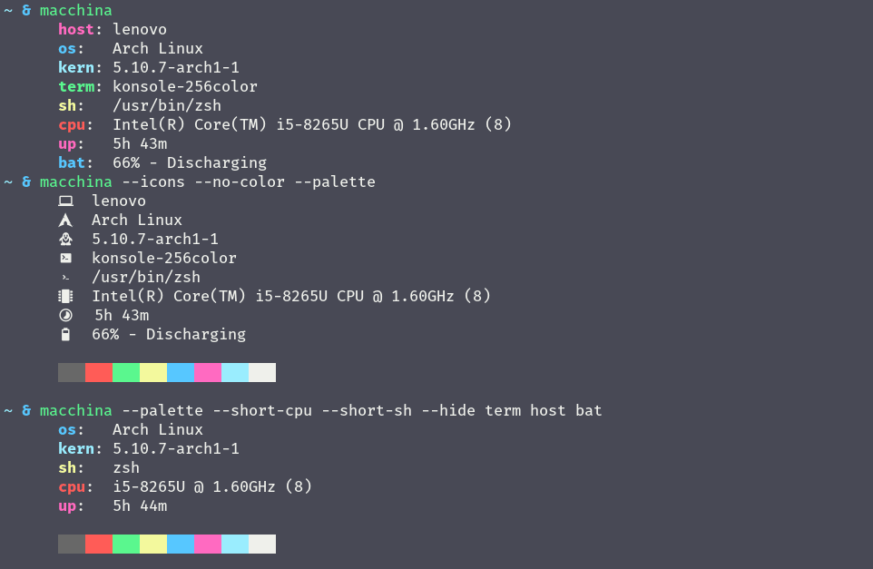

<h1 align="center"> Macchina </h1>

<p align="center">
  
  <a href="https://forthebadge.com/images/badges/made-with-rust.svg" alt="Made With Rust Badge"></a>
</p>


## Table of Contents:
- [About](#about)
- [Changelog](#change)
- [Benchmarks](#bench)
- [Features](#features)
- [Installation](#install)
- [Platform Support](#platform-support)

---

## About Macchina <a name="about"></a>
Macchina lets you view basic system information, like your hostname, your kernel version, memory usage, and much more.
No one wants a slow fetcher, and macchina's main goal is to provide you with handy features while keeping performance a priority.

---

## Changelog <a name="change"></a>
- You can __visualize__ memory usage and battery percentage using progress bars

---

## Benchmarks <a name="bench"></a>
Macchina is pretty fast, see for yourself:

- Execution time is measured using [hyperfine](https://github.com/sharkdp/hyperfine)

| Command | Mean [ms] | Min [ms] | Max [ms] | Relative |
|:---|---:|---:|---:|---:|
| `macchina` | 22.2 ± 0.7 | 21.0 | 25.1 | 1.00 |
| `neofetch` | 243.9 ± 2.3 | 240.0 | 246.9 | 11.01 ± 0.37 |

__Summary__: `macchina` runs __11.01 ± 0.37__ times __faster__ than `neofetch`

- Note that hiding elements using Macchina's __--hide__ argument significantly improves speed

---

## Features <a name="features"></a>
Macchina displays basic system information such as:
- Hostname
- Operating system
- Kernel version
- Package count _(Arch-based distributions only, will print __0__ on any other distribution)_
- Shell path/name in which macchina was ran
- Terminal instance name in which macchina was ran
- Processor _model name_, _frequency_ and _thread count_
- Uptime
- Memory usage
- Battery _percentage_ and _status_
- Palette (using `--palette / -p`)

Macchina supports the following arguments:
- `--no-color` -> disable colors
- `--color <color>` -> specify the key color
- `--separator-color <color>` -> specify the separator color
- `--random-color` -> let macchina choose a random color for you
- `--palette` -> display palette
- `--short-sh` -> shorten shell output (/bin/zsh => zsh)
- `--hide <element>` -> hide elements such as host, os, kern, etc.
- `--bar` -> display memory usage and battery percentage as progress bars
- `--theme <theme_name>` -> change themes
- `--help` -> display help menu
- `--version` -> print version
- `--padding <amount>` -> specify the amount of (left) padding to use

---

## Installation <a name="install"></a>

Macchina is available on [crates.io](https://crates.io/crates/macchina), to install it run:
```
cargo install macchina
```

---

## Will Macchina Work on Your Macchina? <a name="platform-support"></a>

|  Platform     |      Support       |
| :-:           |        :-:         |
| Linux         | :heavy_check_mark: |
| BSD           |     :question:     |
| MacOS         |                    |
| Windows       |                    |

> Cells containing :heavy_check_mark:: Macchina supports that platform

> Cells containing :question:: Macchina has not been tested yet on that platform

> Empty cells: Macchina does not support that platform
