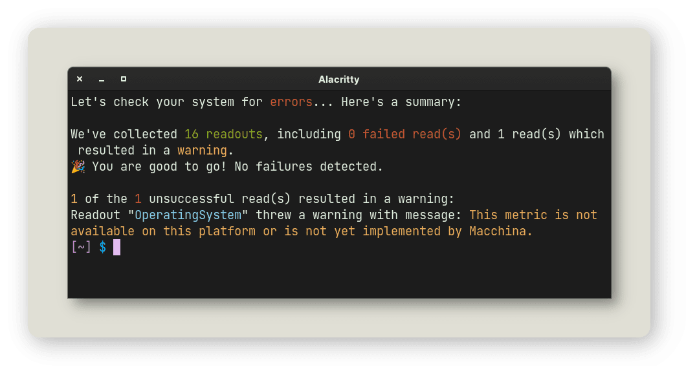

<div align="center">
<h1>Macchina</h1>

Fast, minimal and customizable system information frontend.

Linux • macOS • Windows • NetBSD • OpenWrt • Android


<a href="https://crates.io/crates/macchina">
    
</a>

<a href="https://crates.io/crates/macchina">
    
</a>

</div>

---

# Table of Contents

- [About](#about)
- [Performance](#perf)
- [Features](#features)
- [Configuration](#config)
- [Dependencies](#deps)
- [Installation](#install)
- [Platform Support](#platform-support)
- [Contributors](#contributors)

---

# About <a name="about"></a>

_macchina_ lets you view system information, like your kernel version, uptime,
memory usage, processor load and much more.

If you're interested in the library _macchina_ uses to
fetch system information, have a look at
[libmacchina](https://github.com/Macchina-CLI/libmacchina);
fetching-related issues should be filed on that repository.

---

# Performance <a name="perf"></a>

_macchina_ is lightning fast, see for yourself:

- Execution time is measured using
  [hyperfine](https://github.com/sharkdp/hyperfine)

## 🐧 Linux

This benchmark was performed using an __Intel® Core™ i5-3350P CPU @ 3.10GHz__

| Command    | Mean [ms] | Min [ms] | Max [ms] |
|:---        | --------: | --------:| --------:|
| `macchina` | 4.8 ± 0.4 |      4.5 |      8.1 |

## 👩🏽‍💻 macOS

| Command    | Mean [ms] | Min [ms] | Max [ms] |
| :--------- | --------: | -------: | -------: |
| `macchina` | 5.0 ± 0.2 |      4.7 |      5.9 |

## 🚩 NetBSD

This benchmark was performed inside a virtual machine using an __Intel® Core™ i5-8265U CPU @ 1.60GHz__

| Command    |  Mean [ms] | Min [ms] | Max [ms] |
| :--------- | ---------: | -------: | -------: |
| `macchina` | 17.7 ± 1.6 |     16.8 |     27.2 |

## 💻 Windows

| Command    | Mean [ms] | Min [ms] | Max [ms] |
| :--------- | --------: | -------: | -------: |
| `macchina` | 9.0 ± 0.4 |      8.2 |     11.7 |

---

# Features <a name="features"></a>

## Themes

_macchina_ comes equipped with built-in themes that style their readouts, bars
and separators differently. No extra configuration required.

## Bars

Bars provide a way to visualize data, and each theme styles them differently.
They can be enabled using the `--bar` flag.

<div align="center">

</div>

## Doctor

_macchina_ comes with a very special flag, allowing you analyze which elements
failed to fetch, and why. It can differentiate between errors, and warnings, and
its comprehensive output should help you understand where the issue is coming
from.

```
macchina --doctor
```



---

# Configuration <a name="config"></a>

_macchina_ can be configured through a dotfile,
[macchina.toml](https://github.com/Macchina-CLI/macchina/blob/main/macchina.toml)
is an example dotfile that you can use and build on top of to make it your own.

- In order for _macchina_ to read your dotfile, you need to place
  `macchina.toml` in `$XDG_CONFIG_HOME/macchina`

You can also create custom themes in `JSON` format and use them instead of the
built-in themes that we provide.

- In order for _macchina_ to find your custom themes, which are **JSON** files.
  These files need to placed in `$XDG_DATA_HOME/macchina/themes`, here's an
  example of such a theme:

```json
{
  "name": "Carbon",
  "bar": {
    "Custom": {
      "glyph": "ߋ",
      "symbol_open": "[",
      "symbol_close": "]"
    }
  },
  "color": {
    "Rgb": [231, 198, 100]
  },
  "separator": "⇉",
  "separator_color": {
    "Rgb": [158, 208, 114]
  },
  "spacing": 2,
  "padding": 0,
  "block_title": "┤ Carbon ├",
  "abbreviation": "Classic"
}
```

---

# Dependencies <a name="deps"></a>

These runtime dependencies are __not__ required, but they extend what _macchina_ can do.

### Linux:

- wmctrl
- portage-utils (Gentoo)

### NetBSD:

- wmctrl

---

# Installation <a name="install"></a>

### 🦀 Cargo

```
cargo install macchina
```

### 📦 Pkgsrc

```
pkgin install macchina
```

### 🍻 Homebrew

```
brew install macchina
```

### Termux

```
pkg install macchina
```

### Windows

```
scoop install macchina
```

### Arch Linux

```bash
# Install it using the AUR package that downloads the latest release
git clone https://aur.archlinux.org/macchina.git
cd macchina
makepkg -si

# Or you can use the AUR package that pulls straight from the main branch
git clone https://aur.archlinux.org/macchina-git.git macchina
cd macchina
makepkg -si
```

### Nix

Where `<channel>` is probably `nixpkgs` or `nixos`:

```bash
nix-env -iA <channel>.macchina
```

The [installation wiki page](https://github.com/grtcdr/macchina/wiki/Installation)
lists some other ways you can install the program. You might also prefer running
the [prebuilt binary](https://github.com/grtcdr/macchina/releases) that
corresponds with your operating system.

---

# Platform Support <a name="platform-support"></a>

| Platform  | Support |
| :-------: | :-----: |
| GNU/Linux |    ✓    |
|  NetBSD   |    ✓    |
|   macOS   |    ✓    |
|  Windows  |   80%   |
|  OpenWrt  |    ✓    |
|  Android  |    ✓    |

# 🌍 Contributors <a name="contributors"></a>

[](https://github.com/grtcdr/macchina/graphs/contributors)

_macchina_, like many other open-source projects, would not be where it is right
now without the help of its contributors, thank you all so much!

- Support for **NetBSD** would not have been possible without the help and
  testing of NetBSD/pkgsrc package maintainer
  [pin](https://pkgsrc.se/bbmaint.php?maint=pin@NetBSD.org)
- Support for **macOS** and **Windows** would not have been possible without the
  help, testing and major contributions of
  [123marvin123](https://github.com/123marvin123)
- Support for **OpenWrt** and **Android** was made possible through the many
  contributions of [uttarayan21](https://github.com/uttarayan21)
