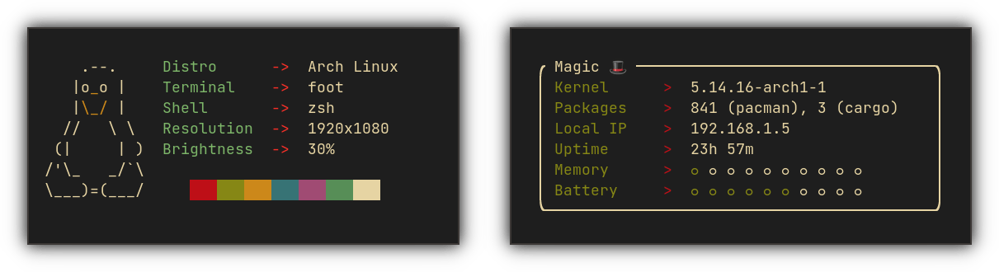

<div align="center">
<h1>Macchina</h1>

Fast, minimal and customizable system information fetcher.

Linux • macOS • Windows • NetBSD • OpenWrt • Android



<a href="https://crates.io/crates/macchina">
    
</a>

<a href="https://crates.io/crates/macchina">
    
</a>

<a href="https://saythanks.io/to/ba.tahaaziz@gmail.com">
    
</a>
</div>

---

# About Macchina
_Macchina_ is a fetching program.
If you're interested in the library, check out [libmacchina](https://crates.io/crates/libmacchina).

_Macchina_ lets you view system information, like your kernel and kernel version, uptime, memory usage, processor load and much more. It provides you with convenient features and extensive customization options but doesn't lose sight of its two main priorities, performance and minimalism.

---

# Performance
_Macchina_ is lightning fast, see for yourself!

- Execution time is measured using [hyperfine](https://github.com/sharkdp/hyperfine)

## 🐧 Linux

| Command | Mean [ms] | Min [ms] | Max [ms] | Relative |
|:---|---:|---:|---:|---:|
| `macchina` | 8.2 ± 0.3 | 7.5 | 9.0 | 1.00 |
| `neofetch` | 155.0 ± 5.1 | 149.5 | 165.9 | 19.02 ± 0.90 |

`macchina` runs __19.02 ± 0.90__ times __faster__ than `neofetch`

## 👩🏽‍💻 macOS

| Command | Mean [ms] | Min [ms] | Max [ms] | Relative |
|:---|---:|---:|---:|---:|
| `macchina` | 5.0 ± 0.2 | 4.7 | 5.9 | 1.00 |
| `neofetch` | 484.5 ± 4.3 | 477.2 | 492.3 | 97.10 ± 3.84 |

`macchina` runs __97.10 ± 3.84__ times __faster__ than `neofetch`

## 🚩 NetBSD

| Command | Mean [ms] | Min [ms] | Max [ms] | Relative |
|:---|---:|---:|---:|---:|
| `macchina` | 17.7 ± 1.6 | 16.8 | 27.2 | 1.00 |
| `neofetch` | 190.2 ± 2.4 | 187.9 | 195.8 | 10.76 ± 0.97 |

`macchina` runs __10.76 ± 0.97__ times __faster__ than `neofetch`

## 💻 Windows
| Command | Mean [ms] | Min [ms] | Max [ms] | Relative |
|:---|---:|---:|---:|---:|
| `macchina` | 9.0 ± 0.4 | 8.2 | 11.7 | 1.00 |
| `neofetch` | 2207.7 ± 53.8 | 2127.1 | 2325.9 | 244.38 ± 13.43 |

`macchina` runs __244.38 ± 13.43__ times __faster__ than `neofetch`

---

# Minimalism

Macchina first started as a barebones fetcher, but has evolved to incorporate the many aspects people love to see in their fetcher. This evolution however did not discard the minimalistic look that I envisioned for Macchina.

Here's what you can make it look like using the various supported flags.

```
macchina -c white --no-box --no-ascii --no-separator --no-bar-delimiter --bar
```


---

# Features
## Themes
_Macchina_ comes equipped with built-in themes that style their readouts, bars and separators differently.
No extra configuration required.

## Bars
Bars provide a way to visualize data, and each theme styles them differently. They can be enabled using the `--bar` flag.


---

## What it fetches
- Host Information
- Product Information
- Kernel Information
- Distribution
- Operating System
- Desktop Environment
- Window Manager
- Package Count [[?]](https://github.com/grtcdr/macchina/wiki/Platform-Support)
- Shell
- Terminal
- Processor Information
- Processor Usage
- Local IP Address
- Uptime
- Memory Usage
- Battery Information
- Palette

---

## Meet Doctor
_Macchina_ comes with a very special flag, allowing you analyze which elements failed to fetch, and why. It can differentiate between errors, and warnings, and its comprehensive output should help you understand where the issue is coming from.

```
macchina --doctor
```


# Dependencies
These dependencies are not required, but they extend what _Macchina_ can do.

### Linux:
- `wmctrl`
- __Gentoo__: `portage-utils`
### NetBSD:
- `wmctrl`

The [dependencies wiki page](https://github.com/grtcdr/macchina/wiki/Dependencies) explains why these dependencies exist.

---

# Installation

- Install it using cargo:
```
cargo install macchina
```

[More installation options.](https://github.com/Macchina-CLI/macchina#install)

---

# Platform Support	

|  Platform   |      Support       |
| :-:         |        :-:         |
| GNU/Linux   |        Yes         |
| NetBSD      |        Yes         |
| macOS       |        Yes         |
| Windows     |        80%         |
| OpenWrt     |        Yes         |
| Android     |        Yes         |

---

# 🌍 Contributors

[](https://github.com/grtcdr/macchina/graphs/contributors)

_Macchina_, like many other open-source projects, would not be where it is right now without the help of its contributors, thank you all so much!

- Support for __NetBSD__ would not have been possible without the help and testing of NetBSD/pkgsrc package maintainer [pin](https://pkgsrc.se/bbmaint.php?maint=pin@NetBSD.org)
- Support for __macOS__ and __Windows__ would not have been possible without the help, testing and major contributions of [123marvin123](https://github.com/123marvin123)
- Support for __OpenWrt__ and __Android__ was made possible through the contributions of [uttarayan21](https://github.com/uttarayan21)
