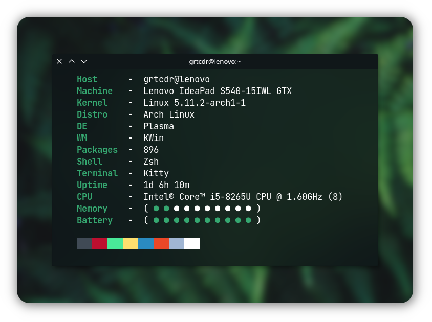

This crate provides the fetching capabilities for [Macchina](https://github.com/grtcdr/macchina), a __fast__ and __minimal__ system information fetching program, written in Rust 🦀.

The information you see in the image below, was fetched by this crate.

# 💬 Tell me more!

Through this crate, you can access a variety of system information, such as:
- Host
  - Username
  - Hostname
- Product
  - Family
  - Name
  - Model
  - Version
- Kernel
  - Type
  - Version
- Distribution
- Operating System
- Desktop Environment
- Window Manager
- Package Count
- Shell
- Terminal
- Processor
  - Model
  - Thread count
- Local IP Address
- Uptime
- Memory Usage
  - Used / Total
- Battery
  - Percentage
  - Status
- Palette

# 💻 Platform Support

|  Platform |      Support       |
| :-:       |        :-:         |
| GNU/Linux |        Yes         |
| NetBSD    |        Yes         |
| macOS     |        Yes         |
| Windows   |        80%         |